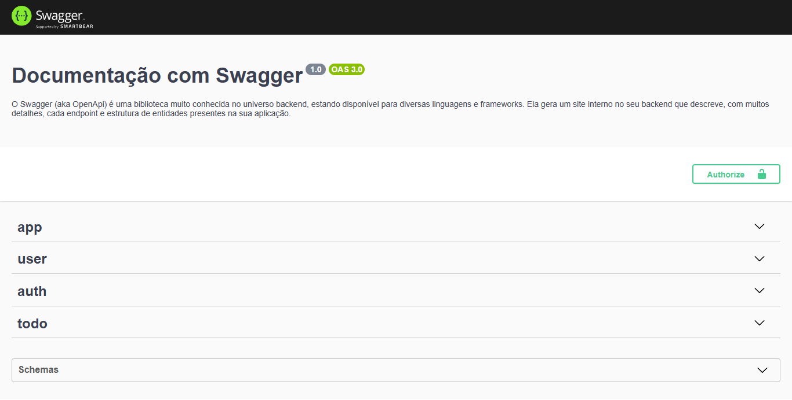

# ToDo Jack API

Uma API destinada ao projeto ToDo Jack.

A aplicação foi desenvolvida utilizando tecnologias como Node, Nest, SQLite, Prisma e Swagger.

## Índice

- [Screenshots](#screenshots)
- [Objetivos](#objetivos)
- [Minha caminhada](#minha-caminhada)
  - [Propriedades e Tecnologias](#propriedades-e-tecnologias)
  - [Meu aprendizado](#meu-aprendizado)
- [Rodando o projeto](#rodando-o-projeto)
- [Autor](#autor)

</br>

## Screenshots



</br>

## Objetivos

Esta API tem como objetivo fornecer funcionalidades essenciais para a gestão de usuários, autenticação e manipulação de tarefas. Ela está organizada em tres categorias principais:

- User: Gerenciamento de usuários e recuperação de dados pessoais.
- Auth: Realização de login e autenticação segura.
- Todo: Criação, consulta, atualização e exclusão de tarefas.

> Utilizando o padrão OpenAPI (Swagger), para facilitar a documentação de todo o processo.

</br>

## Minha caminhada

- [x] Criação inicial do projeto de desenvolvimento da API
    - Criar o projeto com Nest CLI seguindo a estrutura MVC.
    - Criar o schema no banco de dados utilizando Prisma e SQLite.
- [x] Cadastro na plataforma
    - Criar a tabela de usuário no banco de dados.
    - Criar um endpoint POST para a criação do usuário.
    - Implementar a regra de negócio para salvar o usuário.
    - Registrar o usuário na base de dados.
- [x] Login na aplicação
    - Criar um endpoint GET para recuperar o usuário por e-mail e senha.
    - Implementar a regra de negócio para realizar o login.
    - Criar um endpoint POST para receber o e-mail e a senha.
- [x] Gerar JWT access token
    - Gerar um token de acesso JWT.
    - Retornar token ao realizar o login.
    - Criar um endpoint GET para recuperar o usuário logado.
- [x] Registrar uma tarefa
    - Criar uma migration no banco de dados para a tabela de tarefas
    - Implementar a regra de negócio para criação de tarefas.
- [x] Deletar tarefas
    - Implementar a regra de negócio para deletar tarefas por ID.
- [x] Atualizar tarefas
    - Implementar a regra de negócio para atualizar tarefas por ID.

</br>

## Propriedades e Tecnologias

- Node
- Nest
- SQLite
- Prisma
- Swagger

</br>

<!-- ## Meu aprendizado

Ao me deparar com o banco de dados MongoDB pela primeira vez, aprendi sobre o aspecto de modelagem de objetos elaborado pelo Mongoose.

Após estabelecer a conexão com o banco de dados, é necessário criar um esquema para cada objeto:

```tsx
import mongoose from "mongoose";

const HomeSchema = new mongoose.Schema({
    mainText: String,
    description: String,
},
{ timestamps: true });

const Home = mongoose.models.Home || mongoose.model("Home", HomeSchema);

export default Home;
```

Ao definir cada esquema, é necessário criar e exportar o modelo correspondente. Dessa forma, tudo está pronto para ser aplicado em cada rota.

```tsx
import connectToDatabase from "@/database";
import Home from "@/models/Home";
import { NextRequest, NextResponse } from "next/server";

export const dynamic = "force-dynamic";

export async function POST(req: NextRequest) {
    try {
        await connectToDatabase();
        const extractData = await req.json();
        const saveData = await Home.create(extractData);

        if (saveData) {
            return NextResponse.json({
                success: true,
                message: "Data saved successfully",
            });
        } else {
            return NextResponse.json({
                success: false,
                message: "Something goes wrong! Please try again",
            });
        }
    } catch (error) {
        console.log(error);

        return NextResponse.json({
            success: false,
            message: "Something goes wrong! Please try again",
        });
    }
}
```

Veja mais detalhes na documentação oficial [aqui](https://mongoosejs.com/docs/guide.html)
</br>

## Rodando o projeto


### Acesse a aplicação via web [aqui!](https://portifolio-pedroalima.vercel.app/)

#### Ou instale na sua máquina. Para conferir a versão final, é só realizar os seguintes passos:

### 1 - Clonando o Projeto:
Navegue até o diretório onde deseja clonar o projeto. Abra o terminal com o GitBash e execute o comando:

```bash
git clone URL_DO_REPOSITORIO
```
Substitua URL_DO_REPOSITORIO pela URL do repositório deste projeto.

#### 2 - Instalando Dependências:
Navegue até a pasta clonada do projeto e execute o comando no terminal:

```bash
npm install
```
ou
```bash
yarn install
```

#### 3 - Executando o Projeto:
Ainda na pasta do projeto, execute o comando no terminal:

```bash
npm run dev
```
Isso iniciará o servidor de desenvolvimento Next.

</br> -->

## Autor

- LinkedIn - [Pedro A. Lima](https://www.linkedin.com/in/pedroalima6/)